<div align="center">



<br><br>

<!-- <a href="https://github.com/aks1727">
  
</a> -->
<a href="https://github.com/aks1727?tab=repositories">
  
</a>
<a href="mailto:kumarsinhaakshat8@gmail.com">
  
</a>
<a href="https://linkedin.com/in/akshatkumarsinha1704">
  
</a>

</div>

---

### `01` — Engineering Focus

<table>
<tr>
<td width="50%" valign="top">

#### 🧱 Core & Architecture
* **Frontend:** React, Next.js, Redux Toolkit, Tailwind CSS
* **Backend:** Node.js, Express, REST APIs, Microservices
* **Databases:** MongoDB, MySQL, Redis

</td>
<td width="100%" valign="top">

#### 🧪 Quality & Automation
* **Test Frameworks:** Selenium WebDriver, Cucumber BDD, TestNG
* **Practices:** Page Object Model, Data-Driven & Regression Testing
* **Tools:** Postman, SQL Testing, Test Pipeline Design
<br>
<br> 
</td>
</tr>
<tr>
<td width="50%" valign="top">

#### 🧠 Algorithmic Problem Solving
* **Languages:** Java, C, C++, Python
* **Focus:** Data Structures, Algorithms, Dynamic Programming
* **Mindset:** Understanding mechanics over framework magic
<br>
<br>
</td>
<td width="50%" valign="top">

#### ⚙️ DevOps & Toolchain
* **CI/CD & Containers:** Docker, GitLab CI/CD, Jenkins
* **Infrastructure:** Linux, Bash, Git / GitHub
* **Deployment:** Vercel, Netlify, Render
<br>
<br>
</td>
</tr>
</table>

---

### `02` — Technical Matrix

| Domain | Core Stack | Specialized Tools & Ecosystem |
| :--- | :--- | :--- |
| **Languages** |  Java &nbsp;  C &nbsp;  C++ &nbsp;  Python &nbsp;  TypeScript &nbsp;  JavaScript |  SQL &nbsp;  Bash &nbsp;  HTML5 &nbsp;  CSS3 |
| **Web & App** |  Next.js &nbsp;  React &nbsp;  Node.js &nbsp;  Express |  Redux Toolkit &nbsp;  Tailwind CSS &nbsp;  REST APIs |
| **SDET / QA** |  Selenium WebDriver &nbsp;  TestNG / Cucumber BDD |  Postman &nbsp;  SQL Testing &nbsp; Page Object Model |
| **DevOps & Cloud** |  Docker &nbsp;  GitLab CI/CD &nbsp;  Jenkins &nbsp;  Linux |  Git &nbsp;  GitHub Actions &nbsp;  Vercel &nbsp;  Netlify |
| **Explorations** |  Unity 2D/3D &nbsp;  C# |  Event-Driven Systems &nbsp; Microservices Architecture |

---

### `03` — Selected Repositories

| Project | Highlights | Tech Stack |
| :--- | :--- | :--- |
| **[React Music Player](https://github.com/aks1727/React-Music-player)** | Persistent audio state management, responsive UI, robust playlist control. |  React &nbsp;  Redux &nbsp;  Node.js &nbsp;  MongoDB |
| **[OWL CODER — Level 2](https://github.com/aks1727/OWL_CODER-level-2)** | Optimized solutions for advanced DSA, dynamic programming, and competitive challenges. |  Java &nbsp;  C++ |
| **[QA Automation Suite](https://github.com/aks1727)** | Scalable browser test framework featuring re-usable test engines and regression suites. |  Java &nbsp;  Selenium WebDriver |
---
### `04` — Activity & Metrics

<div align="center">

<!-- Profile Summary Card (Active & Working) -->
<a href="https://github.com/aks1727">
  
</a>

<br><br>

<!-- Repos Per Language & Stats Cards -->
<a href="https://github.com/aks1727">
  
</a>
<a href="https://github.com/aks1727">
  
</a>

<br><br>


</div>

---

<div align="center">

```text
Build with intent • Automate the repetitive • Understand the fundamentals • Improve relentlessly
